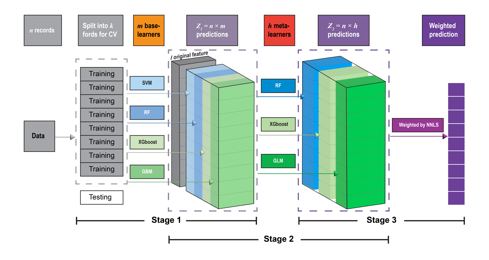

```{r message=FALSE, warning=FALSE, include=FALSE}
knitr::opts_chunk$set(
  	echo = TRUE,
  	eval = FALSE,
	message = FALSE,
	warning = FALSE,
  collapse = TRUE,
  comment = "#>",
  fig.path = "man/figures/README-",
  out.width = "100%"
)
```

<!-- badges: start -->
[](https://codecov.io/gh/Alven8816/deeper_1.0.0?branch=master)
[](https://github.com/Alven8816/deeper_1.0.0/actions)
<!-- badges: end -->

## The framework of DEML model

The goal of deeper is to develop a multiple-level deep ensemble machine learning framework (DEML) for improving the estimation of air pollution concentrations.



The DEML framework proposed in this study is a three-level stacked ensemble approach. It is based on the SuperLearner(SL) ensemble algorithm (Naimi and Balzer 2018; Polley and Van Der Laan 2010; Van der Laan et al. 2007) introduced in the neural network hierarchy structure. Figure above illustrates the overall training procedure of our DEML algorithm.

Our newly build R package mainly include 3 steps:

###    * Step 1: establish the base models
    
Using predictModel() or predictModel_parallel() to establish the base models. A tuningModel() function can be used to tuning the parameters to get the best single base model.

###    * Step 2: stack the meta models
    
We use stack_ensemble(),stack_ensemble.fit(), or stack_ensemble_parallel() function to stack the meta models to get a DEML model.

###    * Step 3: prediction based on the new data set
    
After establishment of DEML model, the predict() can be used predict the unseen data set.

To assess the performance of the models, assess.plot() can be used by comparing the original observations (y in test set) and the prediction. The assess.plot() also return the point scatter plot.

The other functions including CV.predictModel() (referred from SuperLearner), CV.predictModel_parallel(),and CV.stack_ensemble_parallel() could be used to conduct the external cross validation to assess the base models and DEML models for each fold. 

**Note: DEML could not directly deal with missing values and missing value imputation technologies is recommended prior to the use of the DEML model.**

-------------

## Installation

You can install the developing version of deeper from [github](https://github.com/Alven8816/deeper) with:

``` r
library(devtools)
install_github("Alven8816/deeper")
```

-------------

# Example

This is a basic example which shows you how to use deeper:

## 1. Data preparation

### Load the example data and separate to training and testing dataset

```{r example}
library(deeper)

## obtain the example data
data("envir_example")
```

```{r data reading}
set.seed(1234)
size <-
  caret::createDataPartition(y = envir_example$PM2.5, p = 0.8, list = FALSE)
trainset <- envir_example[size, ]
testset <- envir_example[-size, ]
```

### Identify the dependence and independence variables

```{r}
y <- c("PM2.5")
x <- colnames(envir_example[-c(1, 6)]) # except "date" and "PM2.5"
```

## 2.The models can be used

```r
# we need to select the algorithm previously
SuperLearner::listWrappers()
data(model_list) # get more details about the algorithm

```
In the 'type' column, "R": can be used for regression or classification;"N": can be used for regression but variables requre to be numeric style; "C": just used in classification.

## 3.Model Building

## 3.1 Tuning the paramaters of a base model

```{r}
#method 1: using deeper package function
ranger <-
  tuningModel(
    basemodel  = 'SL.ranger',
    params = list(num.trees = 100),
    tune = list(mtry = c(1, 3, 7))
  )

#method 2: employ the Superlearner package "create.Learner" method
#ranger <- SuperLearner::create.Learner(base_learner = 'SL.ranger',params = list(num.trees = 1000),tune = list(mtry = c(1,3,7)))

#method 3: create a function by oneself as follow
#ranger <- function(...){SL.ranger(...,num.trees = 1000)}
```

## 3.2 Establish DEML model

### 3.2.1 Training the (base) ensemble model

```{r}
#training the model with new dataset
#predict the model with several methods(here we choose XGBoost and Random Forest models)

pred_m1 <-
  predictModel(
    Y = trainset[, y],
    X = trainset[, x],
    newX = testset[, x],
    base_model = c("SL.xgboost", ranger),
    cvControl = list(V = 5)
  )

# return the newX prediction results
# get the ensemble model(SL) result
head(pred_m1$ensemble_pre)
# get the single base model results
head(pred_m1$single_pre)

```

The results show the weight, R2, and the root-mean-square error (RMSE) of each model. "ranger_1","ranger_2","ranger_3" note the Random Forest model with parameters mtry = 1,3,7 separately.
    
The results show that mtry = 5 is the best RF model for this prediction.This method could be used to tune the suitable parameters for algorithms.

```{r}
# training the model with separate new data set

pred_m2 <-
  predictModel(
    Y = trainset[, y],
    X = trainset[, x],
    base_model = c("SL.xgboost", ranger),
    cvControl = list(V = 5)
  )

# predict the new dataset
pred_m2_new <- predict(object = pred_m2, newX = testset[, x])

```

### 3.2.2 Training the (base) ensemble model with parallel computing

```{r}
## conduct the spatial CV

# Create a list with 7 (folds) elements (each element contains index of rows to be considered on each fold)

indices <-
  CAST::CreateSpacetimeFolds(trainset, spacevar = "code", k = 7)

# Rows of validation set on each fold

v_raw <- indices$indexOut

names(v_raw) <- seq(1:7)

pred_m3 <- predictModel_parallel(
  Y = trainset[, y],
  X = trainset[, x],
  base_model = c("SL.xgboost", ranger),
  cvControl = list(V = length(v_raw), validRows = v_raw),
  number_cores = 4,
  seed = 1
)
## when number_cores is missing, it will indicate user to set one based on the operation system.

# pred_m3 <- predictModel_parallel(
#     Y = trainset[,y],
#     X = trainset[,x],
#     base_model = c("SL.xgboost",ranger),
#     cvControl = list(V = length(v_raw), validRows = v_raw),
#     seed = 1
#   )

#You have 8 cpu cores, How many cpu core you want to use:
# type the number to continue the process.


# prediction
pred_m3_new <- predict(object = pred_m3, newX = testset[, x])

```

## 3.3 Stacked meta models

Our DEML model includes several meta-models based on the trained base models' results. Different from other ensemble (stacking method), DEML model allow to select several meta-models and run them parallelly and ensemble all the meta-models with the optimal weights.(This step is optinal for analysis).

### 3.3.1 Stacked meta models based on trained base models

```{r}
#Do not include original feature
# object include newX dataset
pre_stack_1 <-
  stack_ensemble(
    object = pred_m1,
    meta_model = c("SL.ranger", "SL.xgboost", "SL.lm"),
    original_feature = FALSE
  )


# object do not include newX dataset
pre_stack_2 <-
  stack_ensemble(
    object = pred_m2,
    meta_model = c("SL.ranger", "SL.xgboost", "SL.lm"),
    original_feature = FALSE,
    X = testset[, x]
  )

# prediction
pred_stack_2_new <- predict(object = pre_stack_2, newX = testset[, x])


#Do include original feature
#object do not include newX dataset
pre_stack_3 <-
  stack_ensemble(
    object = pred_m2,
    meta_model = c("SL.ranger", "SL.xgboost", "SL.lm"),
    original_feature = TRUE,
    X = trainset[, x]
  )

# prediction
pred_stack_3_new <- predict(object = pre_stack_2, newX = testset[, x])

#object include newX dataset
pre_stack_4 <-
  stack_ensemble(
    object = pred_m1,
    meta_model = c("SL.ranger", "SL.xgboost", "SL.lm"),
    original_feature = TRUE,
    X = trainset[, x]
  )

# prediction
pred_stack_4_new <- predict(object = pre_stack_4, newX = testset[, x])

```

### 3.3.2 Stacked meta models from scratch

```{r}
#Do not include original feature
# put new dataset in the training
pred_stack_5 <-
  stack_ensemble.fit(
    Y = trainset[, y],
    X = trainset[, x],
    newX = testset[, x],
    base_model = c("SL.xgboost", ranger),
    meta_model = c("SL.ranger", "SL.xgboost", "SL.glm"),
    original_feature = FALSE
  )


# predict new dataset separately

pred_stack_6 <-
  stack_ensemble.fit(
    Y = trainset[, y],
    X = trainset[, x],
    base_model = c("SL.xgboost", ranger),
    meta_model = c("SL.ranger", "SL.xgboost", "SL.glm"),
    original_feature = FALSE
  )

pred_stack_6_new <-
  predict(object = pred_stack_6, newX = testset[, x])

#Include original feature
# put new dataset in the training
pred_stack_7 <-
  stack_ensemble.fit(
    Y = trainset[, y],
    X = trainset[, x],
    newX = testset[, x],
    base_model = c("SL.xgboost", ranger),
    meta_model = c("SL.ranger", "SL.xgboost", "SL.glm"),
    original_feature = TRUE
  )

# predict new dataset separately

pred_stack_8 <-
  stack_ensemble.fit(
    Y = trainset[, y],
    X = trainset[, x],
    base_model = c("SL.xgboost", ranger),
    meta_model = c("SL.ranger", "SL.xgboost", "SL.glm"),
    original_feature = TRUE
  )

pred_stack_8_new <-
  predict(object = pred_stack_7, newX = testset[, x])
```

### 3.3.3 Stacked meta models with paralleling computing

```{r}
#Do not include original feature
pred_stack_9 <-
  stack_ensemble_parallel(
    object = pred_m3,
    Y = trainset[, y],
    meta_model = c("SL.ranger", "SL.xgboost", "SL.glm"),
    original_feature = FALSE,
    number_cores = 4
  )
pred_stack_9_new <-
  predict(object = pred_stack_9, newX = testset[, x])

#Include original feature
pred_stack_10 <-
  stack_ensemble_parallel(
    object = pred_m3,
    Y = trainset[, y],
    meta_model = c("SL.ranger", "SL.xgboost", "SL.glm"),
    original_feature = TRUE,
    X = trainset[, x],
    number_cores = 4
  )

pred_stack_10_new <-
  predict(object = pred_stack_10, newX = testset[, x])
```

## 4. Cross validation with paralleling computing

  Besides the CV for single base/meta model, an 'external' CV for the whole ensemble model is necessary to assess the performance of DEML modle.
    
  Typically, we conduct a separate holdout sample approach to see the performance of DEML on unseen data.

### 4.1 Cross validation with base models

```{r}
pred_m1_cv <- CV.predictModel_parallel(
  Y = trainset[, y],
  X = trainset[, x],
  base_model = c("SL.xgboost", "SL.ranger"),
  number_cores = 4
)
```

### 4.2 Cross validation with stacked meta models

```{r}
#Include original feature
pred_stack_cv_1 <- CV.stack_ensemble_parallel(
  object = pred_m2,
  Y = trainset[, y],
  X = trainset[, x],
  meta_model = c("SL.xgboost", "SL.ranger"),
  original_feature = TRUE,
  number_cores = 4
)

#Do not include original feature
pred_stack_cv_2 <-
  CV.stack_ensemble_parallel(
    object = pred_m1,
    Y = trainset[, y],
    X = trainset[, x],
    meta_model = c("SL.xgboost", "SL.ranger"),
    original_feature = FALSE,
    number_cores = 4
  )
```


## 5. Assess and plot the results

```{r}
test_p <-
  assess.plot(pre = pred_stack_10_new$pre_meta$pred, obs = testset[, y])

print(test_p$plot)
```
## Citation

Wenhua Yu, Shanshan Li, Tingting Ye,Rongbin Xu, Jiangning Song, Yuming Guo (2022) Deep ensemble machine learning framework for the estimation of PM2.5 concentrations,Environmental health perspectives: [https://doi.org/10.1289/EHP9752](https://doi.org/10.1289/EHP9752)
